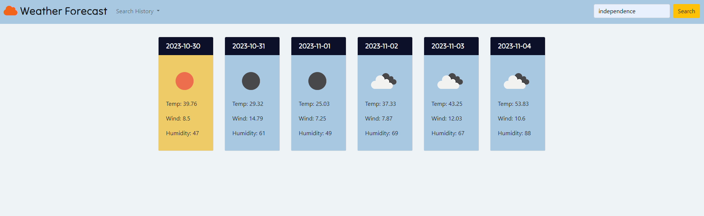

# Weather_Tracker
An app to track the weather based on a location the user specifies

## Description
This webpage acts as a weather dashboard to view the current weather and the five day forecast. Users are able to search by city name and the page will pull data from Open Weather API to display the next 5 days of weather. Data pulled includes the temperature, humidity, wind speed, and an icon indicating the expected conditions. Previously searched cities are saved in the history and the user can click on these to pull up the weather for those saved searches.

## User Story
AS A traveler
I WANT to see the weather outlook for multiple cities
SO THAT I can plan a trip accordingly

## Acceptance Criteria
GIVEN a weather dashboard with form inputs
WHEN I search for a city
THEN I am presented with current and future conditions for that city and that city is added to the search history
WHEN I view current weather conditions for that city
THEN I am presented with the city name, the date, an icon representation of weather conditions, the temperature, the humidity, and the wind speed
WHEN I view future weather conditions for that city
THEN I am presented with a 5-day forecast that displays the date, an icon representation of weather conditions, the temperature, the wind speed, and the humidity
WHEN I click on a city in the search history
THEN I am again presented with current and future conditions for that city

## Screenshot

## Link to Webpage

## License 
See the license for more information